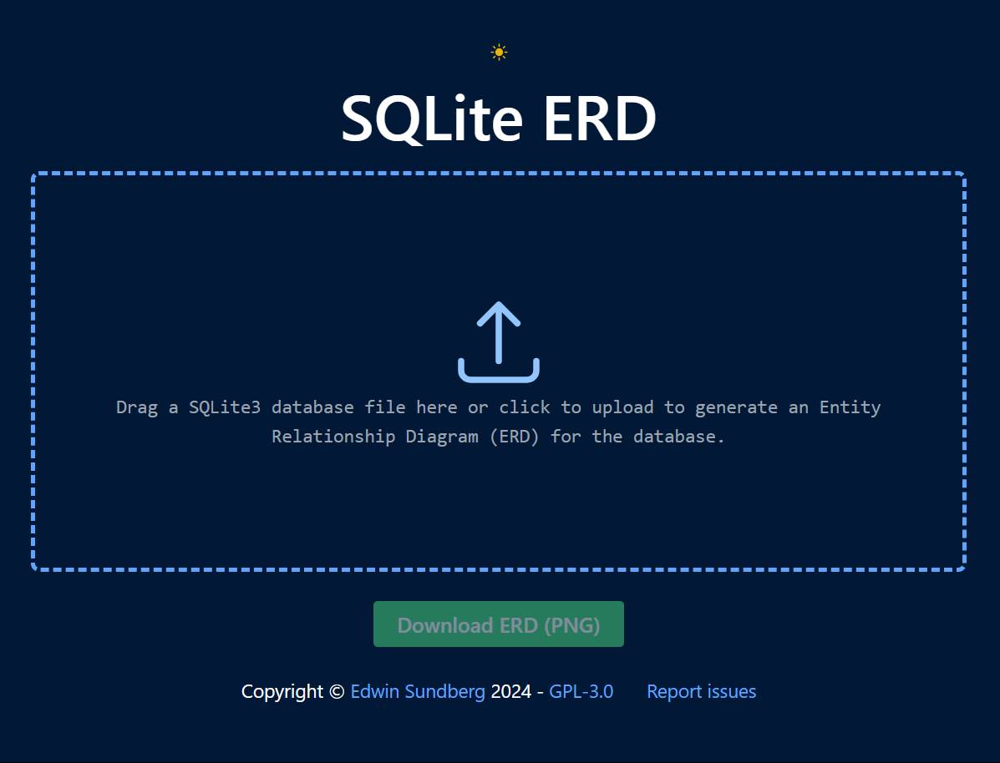
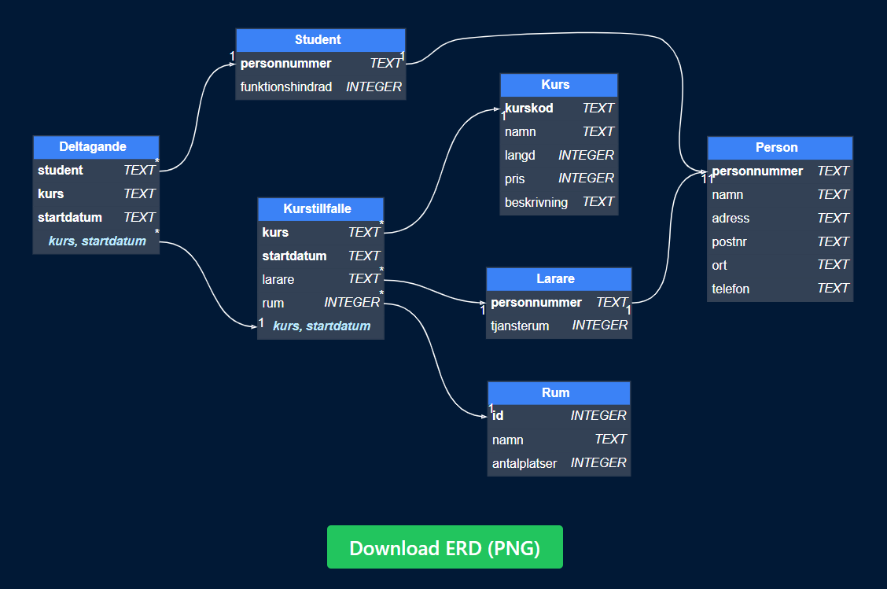

# SQLite ERD
SQLite ERD is a web application that generates an Entity-Relationship Diagram (ERD) from a SQLite database file. It is designed to help students visualize the structure of a database and understand the relationships between tables.

## Features
- Fully Client-Side Execution: All SQL exploration is performed in the browser using sql.js
- Dot Based: Generates a DOT notation from the SQLite database schema before rendering it with Graphviz
- UTF-8 Support: Supports UTF-8 characters in table and column names
- Dark/Light Mode: Toggle between dark and light mode.
- Export: Download the generated ERD as a PNG image.

## Usage
### Public Deployment
A public instance of SQLite ERD is available at [https://sqlite-erd.e-su.se](https://sqlite-erd.e-su.se), powered with Cloudflare Pages.

### Running Locally
To deploy SQLite ERD locally, follow these steps:
1. Clone the repository: `git clone https://github.com/Edwinexd/sqlite-erd.git`
2. Install dependencies: `npm install`
3. Start the development server: `npm start`

## Screenshots

## License
This project is licensed under the GNU General Public License v3.0. See the [LICENSE](LICENSE.md) file for more information.
