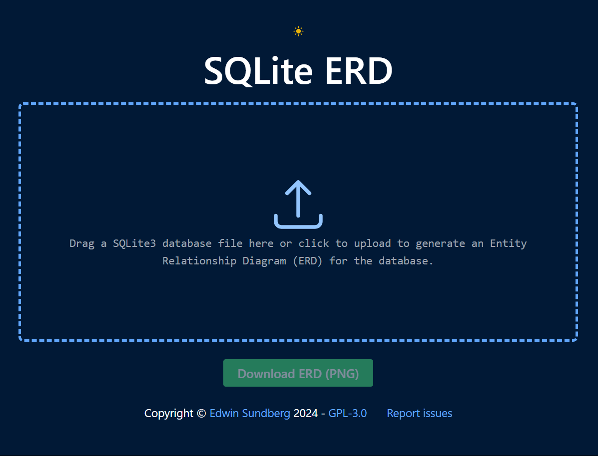
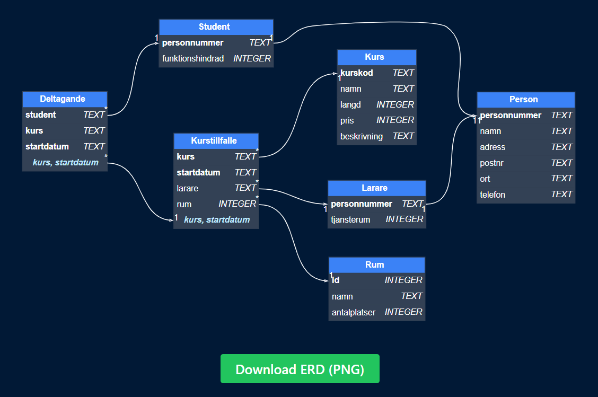

# SQLite ERD
SQLite ERD is a web application that generates an Entity-Relationship Diagram (ERD) from a SQLite database file. It is designed to help students visualize the structure of a database and understand the relationships between tables.

## Features
- **Fully Client-Side Execution**: All SQL exploration is performed in the browser using sql.js
- **Dot Based**: Generates a DOT notation from the SQLite database schema before rendering it with Graphviz
- **UTF-8 Support**: Supports UTF-8 characters in table and column names
- **Dark/Light Mode**: Toggle between dark and light mode
- **Interactive Diagram**: 
  - Drag and drop tables to customize layout
  - Zoom in/out with Ctrl+Scroll
  - Pan the diagram with Shift+Drag or middle-click
  - Visual feedback for interactions
- **Export Options**: 
  - Download as PNG image (with custom layout)
  - Download as SVG vector file (with custom layout)
- **Reset Functionality**: Reset table positions to original layout

## Usage

### Public Deployment
A public instance of SQLite ERD is available at [https://sqlite-erd.e-su.se](https://sqlite-erd.e-su.se), powered with Cloudflare Pages.

### Running Locally
To deploy SQLite ERD locally, follow these steps:
1. Clone the repository: `git clone https://github.com/Edwinexd/sqlite-erd.git`
2. Install dependencies: `npm install`
3. Start the development server: `npm start`

### Interactive Features
Once you've uploaded a SQLite database:
1. **Move Tables**: Click and drag any table to reposition it
2. **Zoom**: Hold Ctrl/Cmd and scroll to zoom in/out, or use the zoom buttons
3. **Pan**: Hold Shift and drag, or use middle-click to pan around the diagram
4. **Export**: Click "Export as PNG" or "Export as SVG" to download with your custom layout
5. **Reset**: Click "Reset Positions" to restore the original auto-generated layout

For more details, see [INTERACTIVE_FEATURES.md](INTERACTIVE_FEATURES.md)

## Screenshots

## License
This project is licensed under the GNU General Public License v3.0. See the [LICENSE](LICENSE.md) file for more information.
